# Reference-free delamination detection using Lamb waves

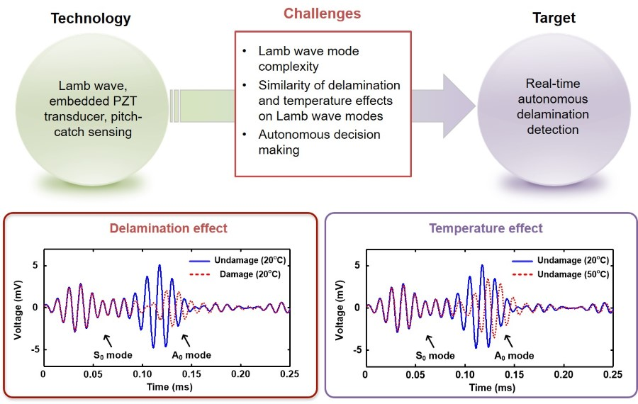

## Description
A new Lamb wave based delamination detection technology is proposed to allow detection of delamination in a single wave propagation path without using prior baseline data or a predetermined decision boundary. **This study shows that, if delamination exists along a wave propagation path, the first arrival anti-symmetric (A0) mode is followed by other A0 modes reflected off from the “inside” delamination (figure below).** Unlike other conventional Lamb wave techniques, the proposed technique takes advantage of the first A0 mode reflected off from the inside delamination to instantly identify the existence of delamination. First, the proposed study employs a dual PZT, which is composed of concentric ring and disk PZT segments, for Lamb wave excitation and a circular PZT for sensing. By activating either the circular or ring PZT segment separately, two pitch-catch Lamb wave signals are obtained from the single wave propagation path. Then, a normalized A0 mode signal is decomposed from the measured Lamb wave signals using a previously developed mode decomposition technique, and the first A0 mode reflected off from the delamination is further extracted using a matching pursuit algorithm. Finally, a reference-free damage classifier is built on the extracted A0 mode reflection from the delamination. **Because the proposed technique does not require baseline signals during the entire delamination detection process, robust delamination detection has been achieved even under varying temperature conditions.** 

### Effects of the Delamination on Lamb Wave Propagation
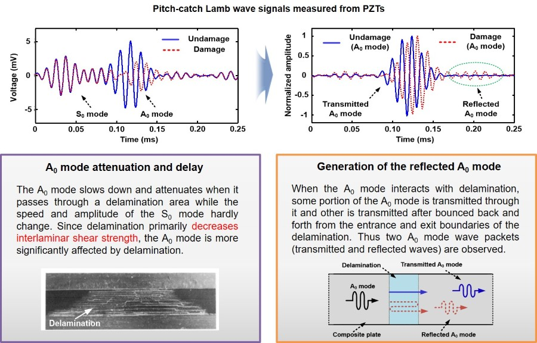

## Publication

* **Chul Min Yeum**, Hoon Sohn, Hyung Jin Lim, and Jeong Beom Ihn. “Reference-Free Delamination Detection Using Lamb Waves.” Structural Control and Health Monitoring 21, no. 5 (May 1, 2014): 675–84. [**[Web]**](http://onlinelibrary.wiley.com/doi/10.1002/stc.1594/abstract),[**[Paper]**](http://chulminy.github.io/cv/Files/Journal/2014_SCHM_Reference_free_Delamination.pdf).

* **Chul Min Yeum**, Hoon Sohn, Jeong Beom Ihn, Hyung Jin Lim, “Reference-free delamination detection using Lamb wave time delay,” the 8h International Workshop on Structural Health Monitoring, Stanford, CA, September 13-15, 2011. [**[Paper]**](http://chulminy.github.io/cv/Files/Conference/2011_IWSHM_Paper.pdf),[**[PPT]**](http://chulminy.github.io/cv/Files/Conference/2011_IWSHM_PPT.pdf).   

## Source Code & Data
* All source code and data are released in this repository. 
* If you use the codes and data for you publication, **please cite my paper(s)**.

## Setup
* `RunFEMValid.m` is to theoretically study the proposed technique using numerical simulation. Please refer to **Section 4** in the [**journal paper**](http://chulminy.github.io/cv/Files/Journal/2014_SCHM_Reference_free_Delamination.pdf).

* `RunExpValid.m` is to examine the feasibility of the proposed technique using real experiment. Please refer to **Section 5** in the [**journal paper**](http://chulminy.github.io/cv/Files/Journal/2014_SCHM_Reference_free_Delamination.pdf).

## Sample Results (Numerical Simulation)

### Configuration of the numerical simulation
> ** The goal is to explore the interaction of Lamb waves with delamination. Delamination is modeled by reducing the shear modulus in a finite area.**  

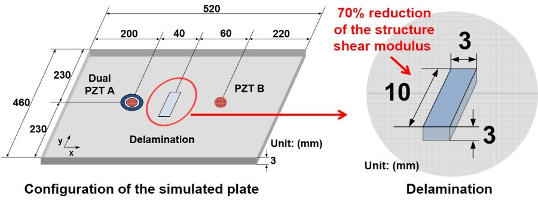

### Comparison of the Lamb wave signals obtained from undamaged and damaged conditions
> **The comparison shows that the A0 modes slow down and attenuate when it passes through a delamination area, whereas the speed and amplitude of the S0 modes do not change much at delamination.** 

Raw signals obtained from undamaged and damaged conditions |  Normalized A0 mode signals obtained from undamaged and damaged raw signals
:------------------------------:|:-------------------------:
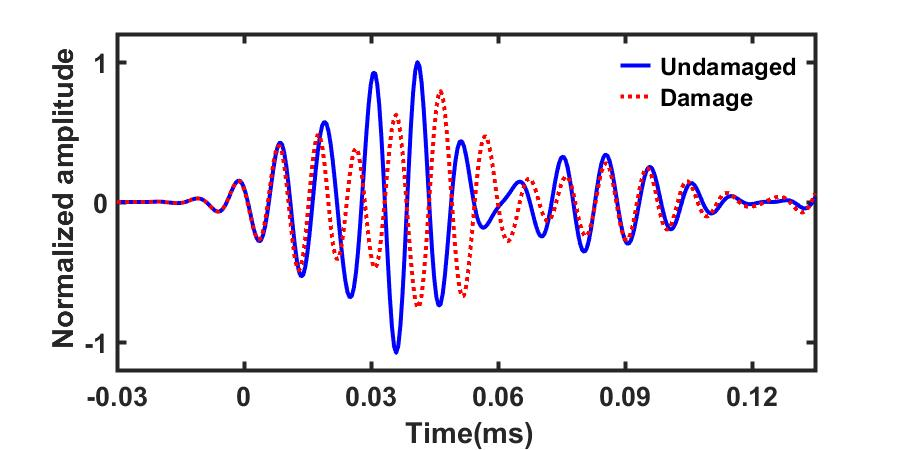     |  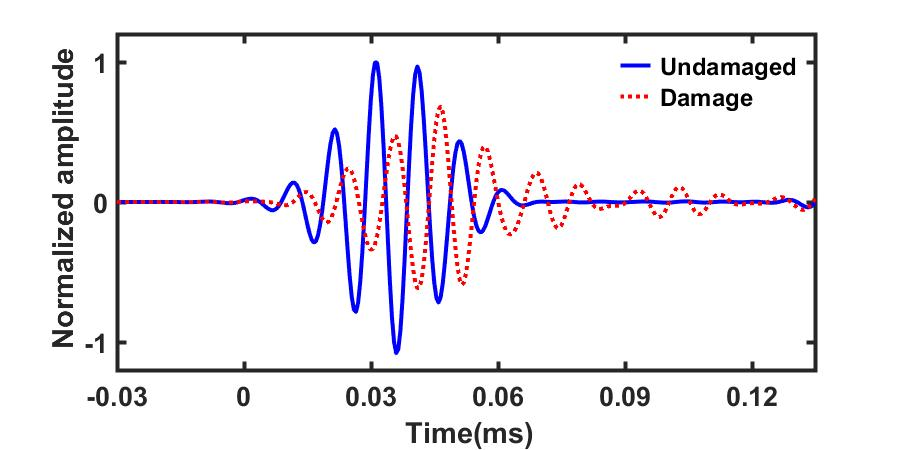

## Sample Results (Experiment)

### Configuration of the experiment
> ** The goal of the experiment is to detect delamination by extracting and analyzing a refelected A0 mode due to delamination. The real delamination damage is created using a impact tester that we designed. Then, damage diagonosis is performed under changing temperature conditions of 20 and 50°C using a temperature chamber.**  

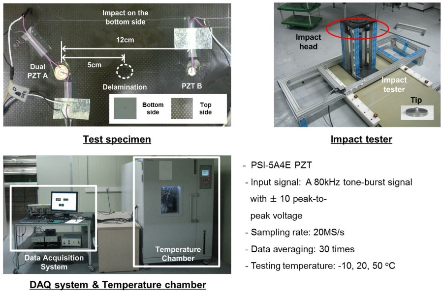

### Comparison of the normalized A0 mode signals obtained from undamaged and damaged conditions and from different temperatures
> ** The findings from these graphs are summarized as follows: **
> * The A0 mode **slows down** when it passes through a delamination areas, whereas the speed of the **S0 mode does not change** much due to delamination. 
> * The** waveforms of the A0 and S0 modes are hardly distorted** by delamination because the fequency content of the propagating waves is little affected by delamination.
> * When the A0 mode interacts with delamination, **some portion of the A0 modes passes through the delamination, and the other is transmitted after bouncing back and forth once** or multiple times from the entrance and exit boundaries of the delamination.  
> * Similar to the effect of delamination, the amplitude and arrival time of the A0 modes are affected by temperature variation. as temperature increases, the A0 mode amplitude decreases and the arrival time of the A0 modes is delayed.  

Measured Lamb wave signals obtained from the undamaged and damaged conditions at 20°C|Normalized A0 mode obtained from the undamaged and damaged conditions  at 20°C   
:------------------------------:|:-------------------------:
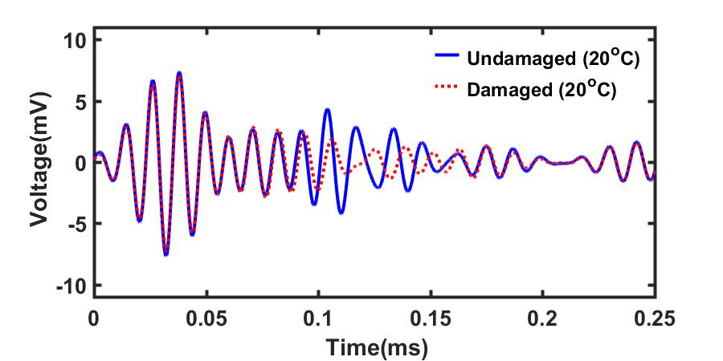     |  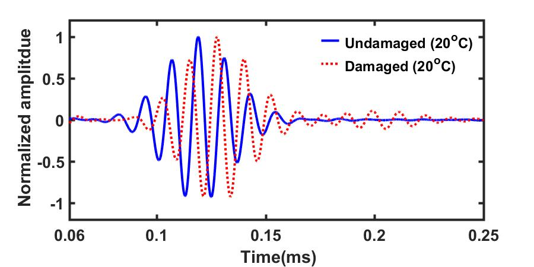

Measured Lamb wave signals obtained from the undamaged conditions at 20 and 50°C|  Normalized A0 mode obtained from the undamaged at 20 and 50°C|
:------------------------------:|:-------------------------:
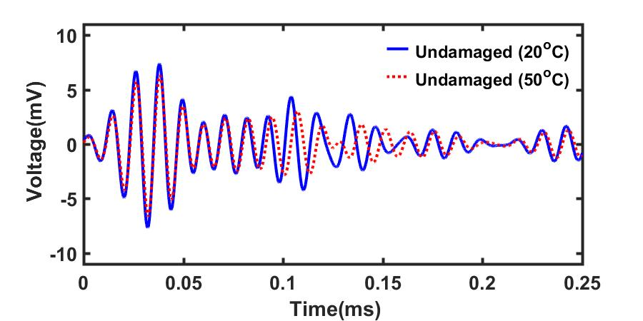     |  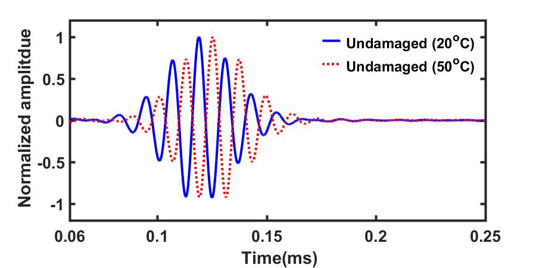

### Autonomous reference-free damage detection under changing temperature conditions.
> If delamination exists, the amplitude of each second wave packet (M2) in both temperature conditions exceeds the corresponding threshold values. Note that the decision boundary(threshold values) in each M2 is instantaneously computed only from the current measurement signal, and the threshold values continuously change because of ambient variations such as temperature.

Without damage|  With damage
:------------------------------:|:-------------------------:
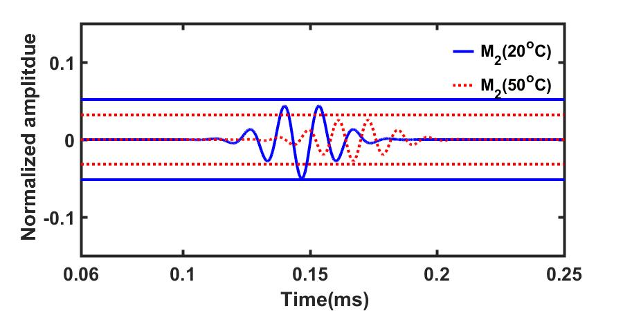     |  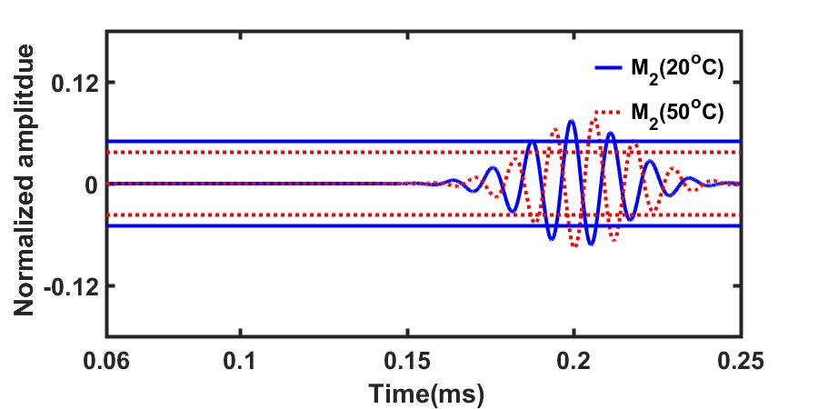
